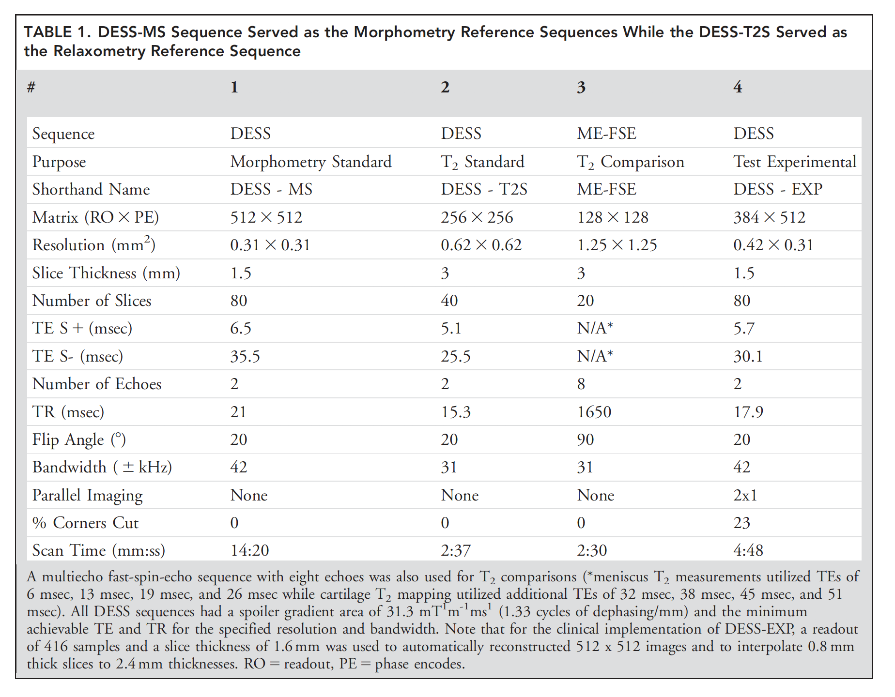

# DOSMA: Deep Open-Source MRI Analysis

This pipeline is an open-source pipeline for MRI image segmentation, registration, and quantitative analysis.

The current code uses the [command line interface](https://www.computerhope.com/jargon/c/commandi.htm) for use. Pull requests for a GUI to command-line translation are welcome.

## How to Cite
```
@misc{arjun_d_desai_2019_2559549,
  author       = {Arjun D. Desai and
                  Marco Barbieri and
                  Valentina Mazzoli and
                  Elka Rubin and
                  Marianne S. Black and
                  Lauren E. Watkins and
                  Garry E. Gold and
                  Brian A. Hargreaves and
                  Akshay S. Chaudhari},
  title        = {ad12/DOSMA: v0.0.9: DOSMA (prerelease)},
  month        = feb,
  year         = 2019,
  doi          = {10.5281/zenodo.2559549},
  url          = {https://doi.org/10.5281/zenodo.2559549}
}
```
Additional citation details can be found [here](https://zenodo.org/record/2559549#.XFyRrs9KjyJ).

## Overview
This repo is to serve as an open-source location for developers to add MRI processing techniques. This includes, but is not limited to:
- image processing tasks (denoising, super-resolution, segmentation, etc)
- relaxation parameter analysis (T1, T1-rho, T2, T2*, etc)
- anatomical features (patellar tilt, femoral cartilage thickness, etc)

We hope that this open-source pipeline will be useful for quick anatomy/pathology analysis from MRI and will serve as a hub for adding support for analyzing different anatomies and scan sequences.

## Supported Commands
Currently, this pipeline supports analysis of the femoral cartilage in the knee using [DESS](https://onlinelibrary.wiley.com/doi/pdf/10.1002/mrm.26577) and cubequant scanning protocols. Basic cones protocol is provided, but still under construction. Details are provided below.

### Scans
The following scan sequences are supported. All sequences with multiple echos, spin_lock_times, etc. should have metadata in the dicom header specifying this information.

#### Double echo steady state (DESS)

##### Data format
All data should be provided in the dicom format.

Dicom files should be named in the format *001.dcm: echo1*, *002.dcm: echo2*, *003.dcm: echo1*, etc.

##### Quantitative Values
*T<sub>2</sub>*: Calculate T<sub>2</sub> map using dual echos

##### Actions
*Segmentation*

### Anatomy
Analysis for the following anatomical regions are supported

#### MSK - knee
*Tissues*: Femoral Cartilage

## Installation
Download this repo to your disk. Note that the path to this repo should not have any spaces. In general, this pipeline does not handle folder paths that have spaces in between folder names.

### Virtual Environment
We recommend using the [Anaconda](https://www.anaconda.com/download) virtual environment to run python.

An `environment.yml` file is provided in this repo containing all libraries used.

### Weights
For pretrained weights for MSK knee segmentation, request access using this [Google form](https://goo.gl/forms/JlxgS3aoUeeUUlVh2). Note that these weights are optimized to run on single-echo RMS DESS sequence as used in the [OA initiative](https://oai.epi-ucsf.org/datarelease/).

Save these weights in an accessible location. **Do not rename these files**.

## Shell interface help
To run the program from a shell, run `python -m opt/path/pipeline` with the flags detailed below. `opt/path` is the path to the file `python`

### Base information
```
usage: pipeline [-h] [--debug] [-d [D]] [-l [L]] [-s [S]] [-df [F]] [-gpu [G]]
                {dess,cubequant,cq,cones,knee} ...

Tool for segmenting MRI knee volumes

positional arguments:
  {dess,cubequant,cq,cones,knee}
                        sub-command help
    dess                analyze DESS sequence
    cubequant (cq)      analyze cubequant sequence
    cones               analyze cones sequence
    knee                calculate/analyze quantitative data for knee

optional arguments:
  -h, --help            show this help message and exit
  --debug               debug
  -d [D], --dicom [D]   path to directory storing dicom files
  -l [L], --load [L]    path to data directory to load from
  -s [S], --save [S]    path to data directory to save to. Default: L/D
  -df [F], --format [F]
                        data format to store information in ['nifti',
                        'dicom']. Default: nifti
  -gpu [G]              gpu id. Default: None

Either `-d` or `-l` must be specified. If both are given, `-d` will be used
```

### DESS
The DESS protocol used here is detailed in [this](https://onlinelibrary.wiley.com/doi/pdf/10.1002/jmri.25883) paper referenced below:

*Chaudhari, Akshay S., et al. "Five‐minute knee MRI for simultaneous morphometry and T2 relaxometry of cartilage and meniscus and for semiquantitative radiological assessment using double‐echo in steady‐state at 3T." JMRI 47.5 (2018): 1328-1341.*

The figure below details the DESS protocol used in this paper:


Figure 1: Supported DESS protocol as referenced [here]((https://onlinelibrary.wiley.com/doi/pdf/10.1002/jmri.25883))


```
usage: pipeline dess [-h] [-t2] [-fc] {segment} ...

positional arguments:
  {segment}   sub-command help

optional arguments:
  -h, --help  show this help message and exit
  -t2         compute T2 map
  -fc         analyze femoral cartilage
```

#### Segmentation
```
usage: pipeline dess segment [-h] [--model [{unet2d}]]
                             [--weights_dir WEIGHTS_DIR] [--batch_size [B]]
                             [-rms]

optional arguments:
  -h, --help            show this help message and exit
  --model [{unet2d}]    Model to use for segmentation. Choices: {unet2d}
  --weights_dir WEIGHTS_DIR
                        path to directory with weights
  --batch_size [B]      batch size for inference. Default: 16
  -rms                  use root mean square (rms) of two echos for
                        segmentation
```

### Cubequant
The cubequant protocol used here is detailed below:

```
usage: pipeline cubequant [-h] [-t1_rho] [-fc] {interregister} ...

positional arguments:
  {interregister}  sub-command help

optional arguments:
  -h, --help       show this help message and exit
  -t1_rho          do t1-rho analysis
  -fc              analyze femoral cartilage
```

#### Interregister
Register cubequant scan to a target scan

```
usage: pipeline cubequant interregister [-h] [-ts TS] [-tm [TM]]

optional arguments:
  -h, --help  show this help message and exit
  -ts TS      path to target image. Type: nifti (.nii.gz)
  -tm [TM]    path to target mask. Type: nifti (.nii.gz)
```

### Cones
The cones protocol used here is detailed below:

```
usage: pipeline cones [-h] [-t2_star] [-fc] {interregister} ...

positional arguments:
  {interregister}  sub-command help

optional arguments:
  -h, --help       show this help message and exit
  -t2_star         do t2* analysis
  -fc              analyze femoral cartilage
```

#### Interregister
```
usage: pipeline cones interregister [-h] [-ts TS] [-tm [TM]]

optional arguments:
  -h, --help  show this help message and exit
  -ts TS      path to target image. Type: nifti (.nii.gz)
  -tm [TM]    path to target mask. Type: nifti (.nii.gz)
```

### MSK Knee
```
usage: pipeline knee [-h] [-ml] [-pid [PID]] [-fc] [-t2] [-t1_rho] [-t2_star]

optional arguments:
  -h, --help  show this help message and exit
  -ml         defines slices in sagittal direction going from medial ->
              lateral
  -pid [PID]  specify pid
  -fc         analyze femoral cartilage
  -t2         quantify t2
  -t1_rho     quantify t1_rho
  -t2_star    quantify t2_star
```

If no quantitative value flag (`-t2`, `-t1_rho`, `-t2_star`) is specified, all quantitative values will be calculated by default.

If no tissue flag (`-fc`) is specified, all tissues will be calculated by default.

## Additional features
### Input/Output (I/O)
Currently, image data I/O is supported in two common formats: Dicom and NIfTI.

By default, the output format is NIfTI. Advantages and disadvantages of this format are listed below:

:white_check_mark: Store 3D volume, rather than slice by slice

:white_check_mark: Less computational overhead

:x: No header information

We recommend using input as Dicom images, which is likely what is produced from any acquisition system, and output as NIfTI volumes.

The default output file format can be changed in the [`defaults.py`](./defaults.py) file by updating the `DEFAULT_OUTPUT_IMAGE_DATA_FORMAT` field. Additionally, to use certain formats in specific cases, use the `--format` flag detailed in [Base Information](### Base information).

### Multiple Orientations
We support volumes acquired in the sagittal, axial, and coronal planes and support reformatting to the expected plane during computation.

Our machine learning methods are trained using sagittally acquired images, so performance may vary for images acquired in different planes (caused by differences in in-plane resolution, FOV, etc.).


## Machine Learning Disclaimer
All weights/parameters trained for any task are likely to be most closely correlated to data used for training. If scans from a particular sequence were used for training, the performance of those weights are likely optimized for that specific scan type. As a result, they may not perform as well on segmenting images acquired using different scan types.

If you do train weights for any deep learning task that you would want to include as part of this repo, please provide a link to those weights and detail the scanning parameters/sequence used to acquire those images. All data contributed to this pipeline should be made freely available to all users.

## Use cases

We detail use cases that could be useful for analyzing data. We assume that all scans are stored per patient, meaning that the folder structure looks like below:

```
research_data
    | patient01
        | dess
            | I001.dcm
            | I002.dcm
            | I003.dcm
            ....
        | cubequant
        | cones
        | <OTHER SCAN SEQUENCE DATA>
    | patient02
    | patient03
    | unet_weights
    ...
```

All use cases assume that the [current working directory](https://www.computerhope.com/jargon/c/currentd.htm) is this repo. If the working directory is different, make sure to specify the path to ```pipeline.py``` when running the script. For example, ```python -m ~/MyRepo/pipeline.py``` if the repo is located in the user directory.

### DESS
*Analyze patient01's knee T<sub>2</sub> properties using DESS sequence*

#### Step 1
*Calculate 3D T<sub>2</sub> map*
```
python -m pipeline -d research_data/patient01/dess -s research_data/patient01/data dess -t2
```

#### Step 2
*Segment femoral cartilage using root mean square (RMS) of two echo dess echos*

```
python -m pipeline -d research_data/patient01/dess -s research_data/patient01/data dess segment -rms --weights_dir unet_weights
```

Note steps 1 and 2 can be combined as the following:
```
python -m pipeline -d research_data/patient01/dess -s research_data/patient01/data dess -t2 segment -rms --weights_dir unet_weights
```

#### Step 3
*Calculate/visualize T<sub>2</sub> for knee tissues per region*

```
python -m pipeline -l research_data/patient01/data -s research_data/patient01/data knee -t2
```

### Cubequant
*Analyze patient 01 knee T<sub>1</sub>-rho properties using Cubequant sequence*

#### Step 1
*Register cubequant volume to first echo of DESS sequence*
```
python -m pipeline -d research_data/patient01/cubequant -s research_data/patient01/data cq interregister -ts research_data/patient01/data/dess/echo1.nii.gz -tm research_data/patient01/data/fc/fc.nii.gz
```

#### Step 2
*Calculate 3D T<sub>1</sub>-rho map of interregistered sequence*
```
python -m pipeline -l research_data/patient01/data cq -t1_rho
```

Note steps 1 and 2 can be combined as the following:
```
python -m pipeline -d research_data/patient01/cubequant -s research_data/patient01/data cq -t1_rho interregister -ts research_data/patient01/data/dess/echo1.nii.gz -tm research_data/patient01/data/fc/fc.nii.gz
```

#### Step 3
*Calculate/visualize T<sub>2</sub> for knee tissues per region*
```
python -m pipeline -l research_data/patient01/data -s research_data/patient01/data knee -t1_rho
```
