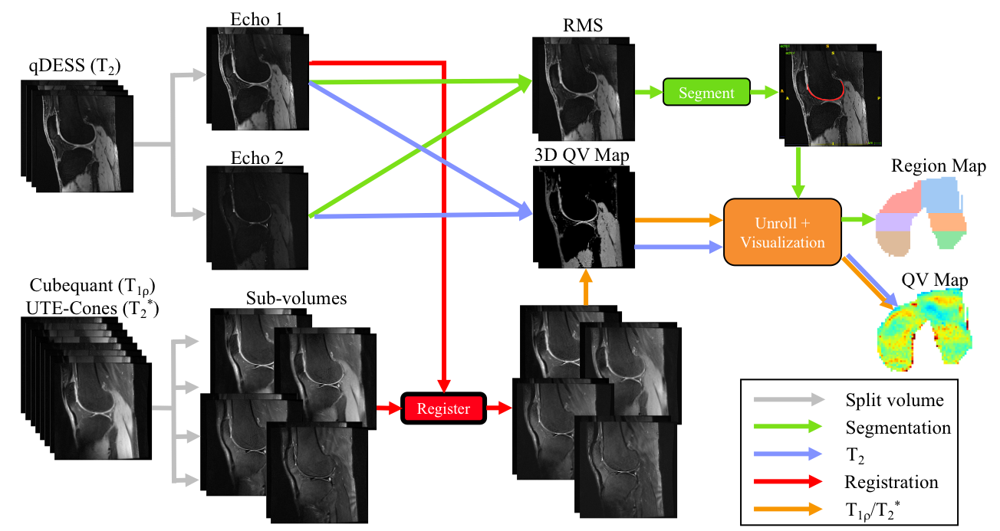

.. _introduction:

**This guide is still under construction**

Introduction
================================================================================
DOSMA is an open-source Python library and application for medical image analysis.

DOSMA is designed to streamline medical image analysis by standardizing medical image
I/O, simplifying array-like operations on medical images, and deploying state-of-the-art
image analysis algorithms. Because DOSMA is a framework, it is built to be flexible enough
to write analysis protocols that can be run for different imaging modalities and scan sequences.

For example, we can build the analysis workflow for a combination
of quantitative DESS, CubeQuant (3D fast spin echo), and ultra-short echo time Cones scans for multiple patients
(shown below) can be done in 7 lines of code:

   Example quantitative knee MRI workflow for analyzing 1. quantitative DESS (qDESS),
   a |T2|-weighted sequence, 2. CubeQuant, a |T1rho|-weighted sequence, and 3. ultra-short echo
   time (UTE) Cones, a |T2star| weighted sequence.

Workflow
--------------------------------------------------------------------------------
DOSMA uses various modules to handle MSK analysis for multiple scan types and tissues:

- **Scan** modules declare scan-specific actions (fitting, segmentation, registration, etc).
- **Tissue** modules handle visualization and analysis optimized for different tissues.
- **Analysis** modules abstract different methods for performing different actions (different segmentation methods, fitting methods, etc.)

**Note**: DOSMA is still in beta, and APIs are subject to change.

Features
--------------------------------------------------------------------------------

Dynamic Input/Output (I/O)
^^^^^^^^^^^^^^^^^^^^^^^^^^
Reading and writing medical images relies on standardized data formats.
The Digital Imaging and Communications in Medicine (DICOM) format has been the international
standard for medical image I/O. However, header information is memory intensive and
and may not be useful in cases where only volume information is desired.

The Neuroimaging Informatics Technology Initiative (NIfTI) format is useful in these cases.
It stores only volume-specific header information (rotation, position, resolution, etc.) with
the volume.

DOSMA supports the use of both formats. However, because NIfTI headers do not contain relevant scan
information, it is not possible to perform quantitative analysis that require this information.
Therefore, we recommend using DICOM inputs, which is the standard output of acquisition systems,
when starting processing with DOSMA.

By default,  volumes (segmentations, quantitative maps, etc.) are written in the NIfTI format.
The default output file format can be changed in the :ref:`preferences <faq-citation>`.

Array-Like Medical Images
^^^^^^^^^^^^^^^^^^^^^^^^^^^
Medical images are spatially-aware pixel arrays with metadata. DOSMA supports array-like
operations (arithmetic, slicing, etc.) on medical images while preserving spatial attributes and
accompanying metadata with the :class:`MedicalVolume` data structure. It also supports intelligent
reformatting, fast low-level computations, and native GPU support.

Disclaimers
--------------------------------------------------------------------------------

Using Deep Learning
^^^^^^^^^^^^^^^^^^^
All weights/parameters trained for any task are likely to be most closely correlated to data used for training.
If scans from a particular sequence were used for training, the performance of those weights are likely optimized
for that specific scan prescription (resolution, TR/TE, etc.). As a result, they may not perform as well on segmenting images
acquired using different scan types.

If you do train weights for any deep learning task that you would want to include as part of this repo, please provide
a link to those weights and detail the scanning parameters/sequence used to acquire those images.

.. Substitutions
.. |T2| replace:: T\ :sub:`2`
.. |T1| replace:: T\ :sub:`1`
.. |T1rho| replace:: T\ :sub:`1`:math:`{\rho}`
.. |T2star| replace:: T\ :sub:`2`:sup:`*`
