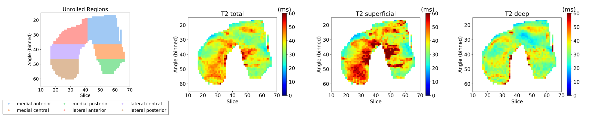

.. _tissues:

Tissues (dosma.tissues)
================================================================================
This page details the different tissues that are supported by DOSMA and briefly
explains the methods used for analysis and visualization.

Tissues are loosely defined as structures of interest in anatomical regions.
For example, both the femur and femoral cartilage are considered tissues are tissues
of the knee.

DOSMA currently supports 4 tissues:

1. Femoral cartilage (fc)
2. Tibial cartilage (tc)
3. Patellar cartilage (pc)
4. Meniscus (men)

Different tissues have different quantitative profiles, visualization methods, and
analysis techniques. The modules for the supported tissues implement and use these
differences for analysis of each tissue.

.. automodule::
   dosma.tissues

.. autosummary::
   :toctree: generated
   :nosignatures:

   dosma.tissues.FemoralCartilage
   dosma.tissues.TibialCartilage
   dosma.tissues.PatellarCartilage
   dosma.tissues.Meniscus

Femoral Cartilage
---------------------------------------------------------------------------------
Femoral cartilage has been closely studied for evaluating knee health. The structure
is often divided into sub-regions to evaluate the sensitivity of different regions of
the knee to chronic diseases such as osteoarthritis. These regions are identified by
three planes (12 regions):

1. **Sagittal**: Medial, Lateral
2. **Coronal**: Anterior, Central, Posterior
3. **Depth**: Deep, Superficial

For example, the deep-anterior-medial femoral cartilage tissue is one region.
To analyze differences in these regions, |T2| maps can be unrolled onto a 2D plane :cite:`monu2017cluster`.

DOSMA supports automatic division of femoral cartilage into these regions and unrolling of these regions.
Unrolled maps are produced for deep, superficial, and total (combined deep and superficial) layers as seen below.

Tibial Cartilage
--------------------------------------------------------------------------------
Tibial cartilage is a flatter surface and is often divided across the three common
planes:

1. **Sagittal**: Medial, Lateral
2. **Coronal**: Anterior, Central, Posterior
3. **Axial**: Deep, Superficial

DOSMA automatically divides the tissue into these regions and produces corresponding
visualizations.

Patellar Cartilage
--------------------------------------------------------------------------------
Patellar cartilage is a thin, flat tissue. Because of this structure, it is not often
divided. However, there has been work that may suggest that deep/superficial differences
in the patellar cartilage may be insightful.

DOSMA divides patellar cartilage into deep/superficial layers across the coronal plane.

Meniscus
--------------------------------------------------------------------------------
DOSMA supports quantitative processing and segmentation of the mensiscus.
However, visualization for the meniscus is not yet supported.

.. Substitutions
.. |T2| replace:: T\ :sub:`2`
.. |T1| replace:: T\ :sub:`1`
.. |T1rho| replace:: T\ :sub:`1`:math:`{\rho}`
.. |T2star| replace:: T\ :sub:`2`:sup:`*`
